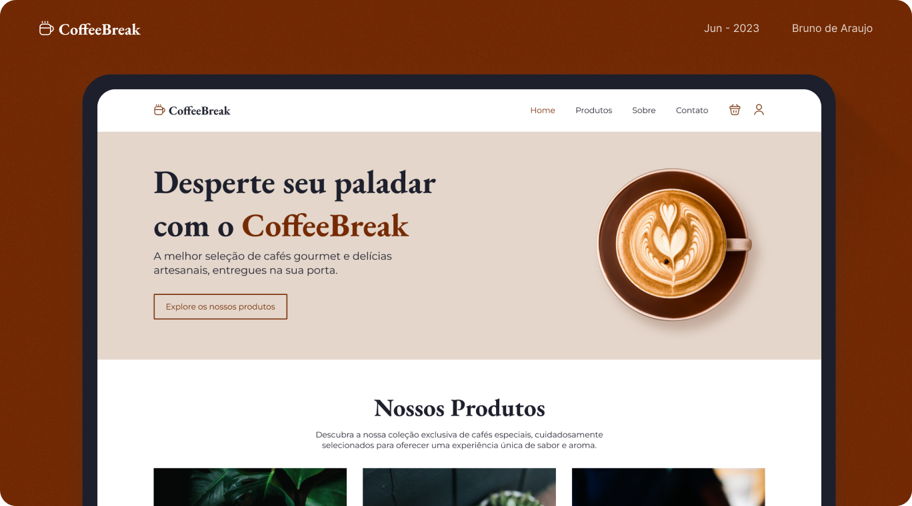

# ☕ CoffeeBreak - Projeto Acadêmico e Aperfeiçoamento Pessoal

**Status:** Finalizado  
**Link do projeto:** [CoffeeBreak - GitHub Pages](https://brunosantosdesign.github.io/coffeebreak/)

## 📝 Descrição
O **CoffeeBreak** foi originalmente desenvolvido em 2023 como parte de uma atividade acadêmica da disciplina de **Desenvolvimento Web I** durante o 1º ciclo do curso de **Desenvolvimento de Software Multiplataforma (FATEC Praia Grande)**.

A proposta da atividade era criar a **página inicial de um site fictício de vendas online** utilizando apenas HTML e CSS, focado em estruturação e layout para desktop.

---

## ✨ **Melhorias para Portfólio**
Recentemente, revisitei este projeto com o objetivo de:
- Implementar **responsividade (Mobile First)**.
- Criar um **menu mobile funcional**.
- Adicionar **animações de entrada (AOS)** para deixar a navegação mais dinâmica.
- Melhorar boas práticas de HTML, CSS e organização de código.

---

## 🎯 Objetivos deste projeto:
- Consolidar conhecimentos de UI/UX aplicados ao Front-End.
- Aprimorar habilidades de responsividade com CSS Flexbox e Grid.
- Praticar HTML5, CSS3 e pequenas interações com JavaScript.
- Simular um projeto real para portfólio.

---

## 🚀 Tecnologias Utilizadas:
- HTML5
- CSS3
- JavaScript (básico)
- AOS (Animate On Scroll)

---

## 📸 Prévia do Projeto:

---

## 📂 Como acessar:
🔗 [Clique aqui para acessar o projeto online](https://brunosantosdesign.github.io/coffeebreak/)

---

## 👨‍💻 Desenvolvedor:
Bruno Santos de Araujo  
[LinkedIn](https://www.linkedin.com/in/brunoaraujo88/)  
[GitHub](https://github.com/brunosantosdesign)
